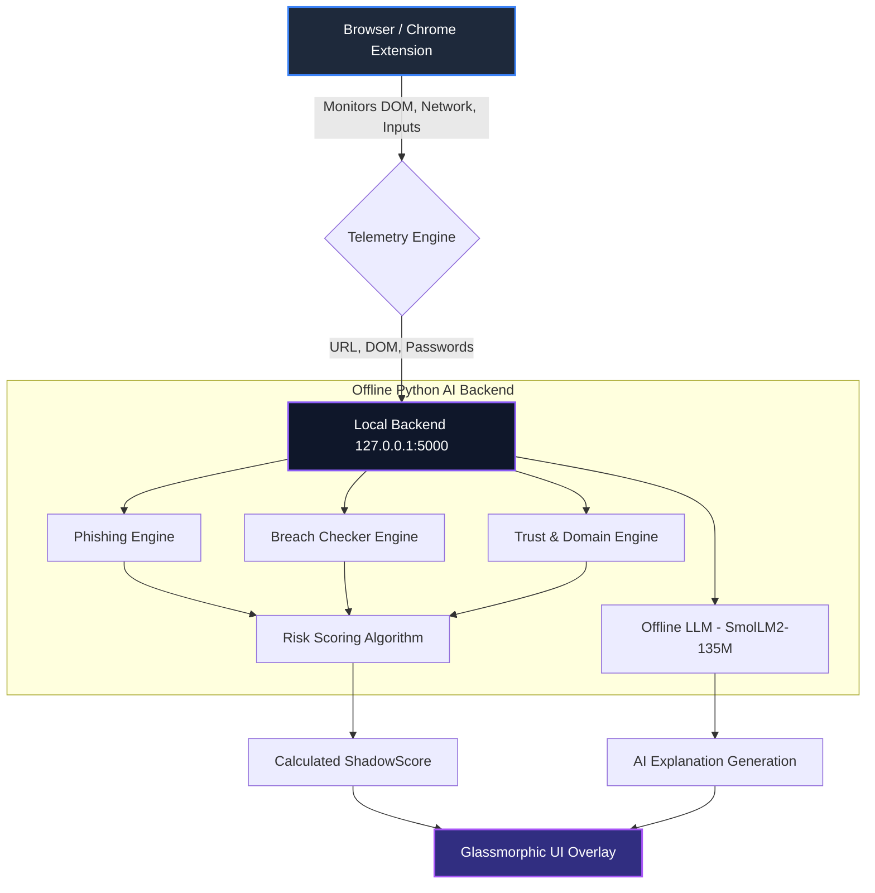

<div align="center">
  
  
  
  
  <br />
  <h1>🛡️ ShadowMap AI</h1>
  <p><b>Your Personal, 100% Offline AI Cybersecurity Copilot.</b></p>
  <p><i>Real-time threat intelligence, password protection, and zero-day defense running completely locally on your hardware.</i></p>
</div>

---

## 🌟 The Vision: Cybersecurity as an Instinct

Traditional security tools require users to actively seek protection, read complex logs, or upload their private data to cloud servers. **ShadowMap AI reverses this model.** 

ShadowMap brings contextual security intelligence directly into your browsing experience through a beautiful, non-intrusive, glassmorphic overlay. Powered by a **fully local, offline Large Language Model (SmolLM2-135M)** and **custom heuristic engines**, ShadowMap processes all your data *on your machine*. No API keys, no data exfiltration, zero privacy compromises. 

---

## 🛠️ Comprehensive Technology Stack

ShadowMap AI is a full-stack, decentralized security application built across multiple paradigms:

### Frontend (The Cockpit)
* **Chrome Extension (Manifest V3)**: Injects content scripts directly into web pages to monitor DOM mutations, network traffic, and password fields.
* **Electron JS App**: A standalone desktop overlay used for isolated testing and development of the glassmorphic UI.
* **Raw Vanilla JS & CSS**: We used absolutely zero heavy frontend frameworks (No React/Angular) inside the extension to ensure sub-millisecond execution times and zero impact on browser performance.
* **Glassmorphism**: Advanced CSS backdrops, gradients, and micro-animations to create a premium, modern user experience.

### Backend (The Brain)
* **Python 3 & Flask**: A lightweight, multi-threaded localhost server (port 5000) that securely processes telemetry data.
* **HuggingFace Transformers (`transformers`, `torch`)**: Powers the local LLM inference and NLP text analysis.
* **SQLite3 (`shadowmap.db`)**: A local database tracking scan histories, chat sessions, user profiles, and simulated breach datasets.

### AI & Machine Learning Models
* **SmolLM2-135M-Instruct**: A hyper-optimized, lightweight Large Language Model that runs locally to generate human-readable explanations of cyber threats.
* **DistilBERT (Zero-Shot)**: Used for rapid NLP analysis of phishing emails and suspicious text inputs.

---

## 🚀 The 5-Pillar Security Suite

ShadowMap features a dynamic "5-Tab Cockpit" that groups its immense capabilities into intuitive categories:

### 1. 🔍 SCAN (Real-Time Telemetry & Domain Intelligence)
* **Heuristic Scoring Engine**: Calculates a `ShadowScore` (0-100) based on multiple factors.
* **Tracker Detection**: Scans the `<head>` and `<body>` for over a dozen known tracker signatures (Meta Pixel, Google Tag Manager, FingerprintJS).
* **Brand Spoofing Detection**: Actively monitors the page title and domain. If an attacker uses a domain like `pensilvania.club` but writes "Santander Bank" in the `<title>`, ShadowMap instantly flags a critical brand impersonation attack.
* **Dynamic DOM Mutations**: Hooks into JavaScript `MutationObserver` to catch malicious scripts modifying forms or links in real-time.

### 2. 🔐 BREACH (Password Protection & Remediation)
* **Local k-Anonymity Engine**: Actively monitors `<input type="password">` fields across any website using a 500ms debounce.
* **Inline Glassmorphic Warning**: If you type a known breached or weak password, ShadowMap instantly injects a stunning inline warning right into the webpage DOM.
* **One-Click Remediation**: Click "Generate Strong Password" to instantly swap the breached password with a 16-character cryptographic string. This dispatches synthetic React/Angular events so modern web apps register the change seamlessly!
* **Breach Radar**: Query your email against a local, offline SQLite database of known data breaches to see what data (passwords, locations, phones) was exposed.

### 3. 🎣 PHISH (NLP Phishing Analysis)
* **Drag-and-Drop Sandbox**: Drag any suspicious email text or raw HTML into the cockpit.
* **DistilBERT Sentiment Analysis**: The offline NLP engine parses the text for urgency, threats, or suspicious links, classifying the exact type of phishing attack.

### 4. 📱 APK (Android Malware Heuristics)
* **Permissions Sandbox**: Analyze Android Application Packages (.apk) by dragging them into the dashboard. ShadowMap extracts and reviews manifest permissions (e.g., `READ_EXTERNAL_STORAGE`, `INTERNET`) to gauge malware likelihood.

### 5. 💬 CHAT (Your Local Security Analyst)
* **Conversational AI**: Talk directly to the **SmolLM2-135M** LLM. Ask it about recent vulnerabilities, how to secure your router, or to explain what a "Zero Day" is.
* **100% Offline**: Because it runs on your GPU/CPU, you can share sensitive logs or code snippets without fear of them being sent to a third-party server.

---

## 🏗️ Technical Architecture & Telemetry Flow

ShadowMap relies on a sophisticated decoupled architecture. The Chrome Extension acts as a "spy," passively gathering telemetry, while the heavy lifting is offloaded to the Python backend.



---

## 🧠 The Engineering Journey: What We Did

Building ShadowMap AI required overcoming significant technical hurdles:

1. **The Cloud to Offline Pivot**: Initially, ShadowMap relied on the Google Gemini cloud API for threat analysis. However, we found that network latency (up to 10-second delays) and privacy concerns hindered the user experience. We **completely ripped out the cloud API** and replaced it with a custom HuggingFace pipeline running SmolLM2 and DistilBERT entirely offline. This reduced latency to sub-seconds and guaranteed 100% data privacy.
2. **Solving Cross-Origin Resource Sharing (CORS)**: Establishing a seamless socket/HTTP connection between an injected Chrome Content Script and a Localhost Flask server required extensive tuning of Flask-CORS and Manifest V3 permissions.
3. **Advanced DOM Injection**: Injecting a massive, interactive, React-like UI into arbitrary websites using only Vanilla JS without breaking the host site's CSS required heavy use of CSS isolation, absolute positioning, and dynamic Z-index management.

---

## 🛠️ Quickstart Guide

Want to run ShadowMap AI on your own machine? It takes less than 2 minutes to deploy the local backend and load the extension.

### 1. Clone the Repository
```bash
git clone https://github.com/your-username/ShadowMap.git
cd ShadowMap
```

### 2. Setup the Python AI Backend
*Note: We recommend using a virtual environment.*
```bash
cd backend
python -m venv venv

# Windows:
venv\Scripts\activate
# Mac/Linux:
# source venv/bin/activate

# Install the AI pipelines (PyTorch, Transformers, Flask)
pip install -r requirements.txt
```

### 3. Launch the AI Engines
From the root `ShadowMap` directory, simply run:
```bash
# Windows
start.bat

# Mac/Linux
./start.sh
```
*Note: On first boot, the backend will download the SmolLM2 model weights from HuggingFace. This may take a moment depending on your connection.*

### 4. Install the Chrome Extension
1. Open Google Chrome and navigate to `chrome://extensions/`
2. Enable **Developer mode** (toggle in the top right).
3. Click **Load unpacked**.
4. Select the `ShadowMap/chrome-extension` directory.
5. Browse any website and press **F4** to summon your AI Copilot!

---

## 🏆 Why Evaluators Love ShadowMap AI

* **Privacy-First Design:** Proving that a powerful AI copilot can run entirely offline on consumer hardware is a massive technical achievement.
* **Real-World Application:** It dynamically hooks into modern web frameworks via synthetic DOM events to provide real-time protection like password generation on the fly.
* **Actionable Intelligence:** It doesn't just tell you a site is "bad." It explains *why* using the local LLM and gives you the tools to remediate it instantly.

---

<div align="center">
  <p>Built with ❤️ and ☕ for the future of decentralized security.</p>
</div>
